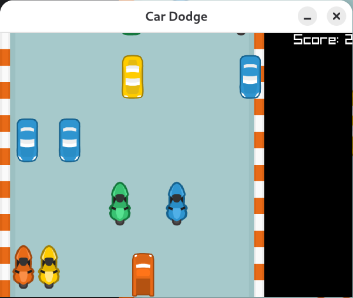

# Car Dodge

Игра про уклонение от препятствий на C++ и [raylib](https://www.raylib.com/).
Машинка игрока свободно двигается по полю, сверху вниз выезжают барьеры
(мотоциклы и машины), которые нужно объезжать. Под фоновую музыку ехать
веселее.



## Управление

| Клавиша | Действие |
|---|---|
| `↑` `↓` `←` `→` | Двигать машинку |
| `Enter` | Начать новую игру (на экране окончания игры) |
| `Esc` | Выход |

Игра заканчивается при столкновении с барьером. За каждый увёрнутый
барьер начисляется одно очко.

## Зависимости

- CMake ≥ 3.20
- Компилятор с поддержкой C++20
- [raylib](https://www.raylib.com/) 5.x

## Сборка

```sh
cmake -B build
cmake --build build
```

Собранный исполняемый файл — `build/car_dodge`. При запуске напрямую
из `build/` игра ищет текстуры и музыку по путям `/usr/share/car_dodge/images`
и `/usr/share/car_dodge/music` (см. раздел «Установка» ниже).

## Установка (.deb)

Проект умеет собирать пакет `.deb`, устанавливающий бинарь в
`/usr/bin`, текстуры в `/usr/share/car_dodge/images` и музыку в
`/usr/share/car_dodge/music`:

```sh
cmake -B build
cmake --build build
cd build
cpack -G DEB
sudo dpkg -i car-dodge_*_amd64.deb
```

После установки игра запускается командой `car_dodge` из любого места.

## Структура проекта

```
src/
├── main.cpp        # точка входа, игровой цикл
├── game_data.hpp   # классы GameData и Barrier — состояние и логика игры
├── game_data.cpp
├── constant.hpp    # константы игры (размеры окна, объектов, скорости)
├── images/         # текстуры машинки, барьеров и дороги
└── music/          # фоновая музыка
```
